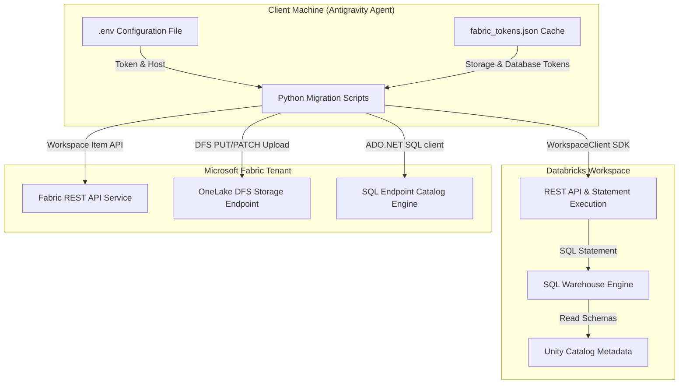
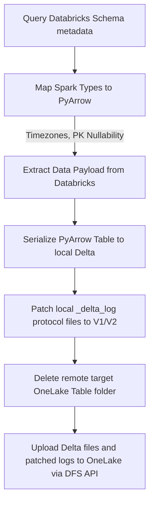

# Architectural & Operational Guide: Databricks to Microsoft Fabric Migration

This guide details the end-to-end architecture, connectivity mechanisms, and step-by-step translation logic used to migrate databases, schemas, tables, views, notebooks, constraints, dynamic data masking, and orchestration pipelines from Databricks Unity Catalog to Microsoft Fabric.

---

## 1. Connectivity & Authentication Architecture

The migration is orchestrated by the Antigravity agent running on a client machine. The agent manages concurrent connection contexts to both Databricks and Microsoft Fabric:



### **A. Databricks Connection**
* **Mechanism:** Python `databricks-sdk` library.
* **Credentials:** Read from the local `.env` configuration file:
  * `DATABRICKS_HOST`: Workspace URL.
  * `DATABRICKS_TOKEN`: Personal Access Token (PAT) with admin/metadata privileges.
  * `DATABRICKS_WAREHOUSE_ID`: Target SQL Warehouse ID used to run queries.
* **Metadata Extraction:** Performed by calling the Databricks Statement Execution API. Instead of pulling raw catalog lists, the agent executes T-SQL/Spark SQL statements against `information_schema` tables (e.g. `information_schema.columns`, `information_schema.tables`) to fetch catalogs, schemas, tables, comments, column types, and nullable flags.

### **B. Microsoft Fabric Connection**
* **Mechanism:** HTTPS REST Client (via Python `urllib`) and T-SQL Client (via PowerShell `System.Data.SqlClient`).
* **Credentials:** Read from `fabric_tokens.json` in the user cache, storing three specialized tokens:
  1. `fabric_token`: For Fabric REST APIs (Workspace provisioning, item lists, notebook uploads).
  2. `storage_token`: For ADLS DFS REST API calls (uploading Delta files directly to OneLake).
  3. `database_token`: For T-SQL ADO.NET database endpoint connections (deploying views, constraints, masking, and security schemas).

---

## 2. Table Migration Process

To migrate a table from Databricks to Microsoft Fabric, the agent follows a multi-step extraction, localization, conversion, and upload workflow:



### **Step 1: Schema Extraction & Mapping**
The agent queries columns metadata from Databricks catalog `delphi_dev` schemas and converts SQL data types into corresponding PyArrow structures:
* **Nullability Overrides:** If a column is a target Primary Key, `nullable=False` is strictly enforced in the Arrow schema.
* **Timezone Mapping (NTZ Fix):** Standard timezone-naive timestamp columns in Spark map to PyArrow `pa.timestamp('us')`. Writing this to Delta creates a `TIMESTAMP_NTZ` Delta feature. Because Fabric SQL Endpoints **do not support** `TIMESTAMP_NTZ`, this causes columns to throw warnings and disappear from `SELECT *` results.
  * *The Fix:* All timestamps are explicitly mapped to **`pa.timestamp('us', tz='UTC')`** and localized in Pandas using `dt.tz_localize('UTC')` before Delta serialization. This maps columns to standard T-SQL `datetime2` columns on the SQL Endpoint.

### **Step 2: Local Delta Serialization**
Data is retrieved from Databricks via statement execution, loaded into a Pandas DataFrame, cast to align with the Arrow schema, and written to a temporary local directory using:
```python
deltalake.write_deltalake(LOCAL_TEMP_DIR, pyarrow_table)
```

### **Step 3: Delta Log Protocol Patching**
To ensure the local table is readable by both Fabric Spark notebooks (which checks protocol flags) and the SQL Endpoint (which reads constraint metadata):
* The agent reads `_delta_log/00000000000000000000.json`.
* It updates the `protocol` line to remove custom features lists and set:
  ```json
  {"protocol": {"minReaderVersion": 1, "minWriterVersion": 2}}
  ```
* This patches the table to legacy Delta v1/v2 format, matching Fabric's protocol engine.

### **Step 4: Uploading to OneLake**
Using the `storage_token`, the agent calls the OneLake DFS REST API recursively to delete the target schema table folder (to prevent leftover partition files) and uploads each local file:
1. **Create File:** `PUT https://onelake.dfs.fabric.microsoft.com/{workspace_id}/{lakehouse_id}/Tables/{schema}/{table}/{path}?resource=file`
2. **Append Data:** `PATCH ...?action=append&position=0` (sends raw binary payload)
3. **Flush / Commit:** `PATCH ...?action=flush&position={length}`

---

## 3. View Migration Process

Views are migrated via direct SQL Endpoint catalog DDL commands rather than physical file copies:

1. **Extract View DDL:** Run `SHOW CREATE TABLE <schema>.<view_name>` against the Databricks SQL Warehouse.
2. **Syntax Translation:** The agent cleans and translates the query structure from Spark SQL to Microsoft Fabric T-SQL rules:
   * Strip Unity Catalog metadata properties (e.g. `DEFAULT COLLATION UTF8_BINARY`, `WITH SCHEMA COMPENSATION`).
   * Clean catalog paths (`delphi_dev.silver.presales_opportunities` $\rightarrow$ `silver.presales_opportunities`).
   * **Column Identifier Translation:** Spark SQL backticks (`` `Probability %` ``) are converted to T-SQL square brackets (`[Probability %]`).
3. **Gold Schema verification:** Connects to the new SQL Endpoint via ADO.NET and runs `IF NOT EXISTS (SELECT * FROM sys.schemas WHERE name = 'gold') EXEC('CREATE SCHEMA gold')`.
4. **Deploy View:** Drops any existing view and executes the translated view DDL.

---

## 4. Notebook Conversion & Attachment

Databricks notebooks are translated cell-by-cell to run natively on Fabric Spark compute:

### **A. Syntax Regex Replacements**
The agent parses notebook cells and applies regex replacement rules:
* **Catalog references:** Strips `delphi_dev.` catalog qualifiers from SQL queries and PySpark namespace calls.
* **FS API Calls:** Translates `dbutils.fs` (e.g., `.ls`, `.cp`, `.mv`, `.rm`, `.mkdirs`) to Fabric-compatible `mssparkutils.fs` equivalents.
* **Widgets/Parameters:** Maps `dbutils.widgets.get("name")` to the Fabric context `mssparkutils.runtime.context.get("params", {}).get("name")`.
* **Execution Exits:** Maps `dbutils.notebook.exit("val")` to `mssparkutils.notebook.exit("val")`.

### **B. Lakehouse Attachment Metadata Injection**
If a notebook does not have a default Lakehouse attached, queries to local tables (without direct workspace URIs) will fail.
Before base64-encoding the translated `.ipynb` JSON content for upload, the agent injects the default Lakehouse workspace connection properties directly inside the notebook's `"metadata"` block:

```json
{
    "metadata": {
        "dependencies": {
            "lakehouse": {
                "defaultLakehouse": "<target_lakehouse_guid>",
                "defaultLakehouseName": "delphi_dev",
                "defaultLakehouseWorkspaceId": "<target_workspace_guid>"
            }
        }
    }
}
```
This binds the target schema-enabled Lakehouse context to the notebook when uploaded to Fabric.

---

## 5. Jobs & Pipelines Orchestration

Databricks workflows (Jobs) containing sequential notebook tasks are translated into **Fabric Data Pipelines**:

1. **Item Creation:** A new Data Pipeline item is created in the target workspace via the REST API (`displayName: pl_master_presales, type: DataPipeline`).
2. **Chaining sequence:** The agent compiles a `pipeline-content.json` structure consisting of sequential `TridentNotebook` activity blocks.
3. **Execution dependencies:** Chains tasks together using the `dependsOn` payload property:
   ```json
   "dependsOn": [
       {
           "activity": "Ingest_to_ADLS",
           "dependencyConditions": ["Succeeded"]
       }
   ]
   ```
4. **Dynamic exit parameter passing:** Configures parameters to read from preceding task exits dynamically:
   ```json
   "param_pipeline_run_id": {
       "value": "@activity('nb_generate_run_id').output.firstExitValue",
       "type": "Expression"
   }
   ```
5. **Upload definition:** Encodes the JSON to base64 and posts it to the workspace updateDefinition API.

---

## 6. Constraints & Security Recreation

Database-level constraints and security rules are executed directly against the SQL Endpoint using ADO.NET connections:

### **A. Key Constraints**
Fabric SQL Endpoint enforces informational (non-enforced) Primary and Foreign Key constraints. After table data sync is verified:
* **Primary Key:** `ALTER TABLE silver.presales_opportunities_enriched ADD CONSTRAINT pk_opportunities PRIMARY KEY NONCLUSTERED (Opportunity_ID) NOT ENFORCED;`

### **B. Dynamic Data Masking**
Masking policies are database-level constructs and must be redeployed against columns on the SQL Endpoint:
* **Column Masking:** `ALTER TABLE silver.presales_opportunities_enriched ALTER COLUMN Client ADD MASKED WITH (FUNCTION = 'default()');`

---

## 7. Operational Validation & Impersonation Testing

To confirm that row counts, view compilations, constraints, and Dynamic Data Masking are fully operational, the agent connects to the new SQL Endpoint and executes:

1. **Row Count Verification:** Compares the row count of every OneLake schema table and view against Databricks counts.
2. **Metadata constraint queries:** Reads from system tables (`sys.key_constraints` and `sys.columns`) to check that constraint keys and the `is_masked` properties are active in the catalog database.
3. **Impersonation tests:** Creates a temporary test user without a login, grants `SELECT` privileges, executes a query under that user context to verify that the `Client` column yields masked values, and then reverts security contexts:
   ```sql
   CREATE USER MaskTestUser WITHOUT LOGIN;
   GRANT SELECT ON silver.presales_opportunities_enriched TO MaskTestUser;
   EXECUTE AS USER = 'MaskTestUser';
   SELECT Client FROM silver.presales_opportunities_enriched; -- (Verifies masking output)
   REVERT;
   DROP USER MaskTestUser;
   ```

---

## 8. Automation Scripts Reference

The migration process is automated end-to-end using specialized Python orchestration scripts. Each script is designed to run sequentially:

### **Step 1: Workspace & Lakehouse Setup**
* **Script:** `run_presales_step1.py`
  * *Purpose:* Calls the Fabric REST API to create a new target Workspace and registers a schema-enabled Lakehouse named `delphi_dev` with the payload parameter `"enableSchemas": true`.
  * *Output:* Creates and caches the Workspace IDs and Lakehouse IDs in `fabric_metadata_mapping.json`.
* **Script:** `get_true_connection_string.py`
  * *Purpose:* Polls the newly provisioned Fabric workspace using the sqlEndpoints API until the SQL Endpoint properties are indexed, retrieving and caching the dynamic SQL connection string.
  * *Output:* Saves the connection details in the mapping registry.

### **Step 2: Table Data & Schema Extraction**
* **Script:** `run_presales_step2.py`
  * *Purpose:* Connects to Databricks SQL Warehouse, dynamically queries the schema descriptions, casts datetimes to UTC timezone-aware variables to resolve `TIMESTAMP_NTZ` column hidden data issues, serializes records to local Delta directories, patches Delta logs to protocol v1/v2, and uploads them recursively to OneLake.
  * *Output:* All physical tables synced to OneLake schemas.

### **Step 3: Notebook Import & Attachment**
* **Script:** `migrate_presales_notebooks.py`
  * *Purpose:* Downloads notebook assets from Databricks workspace directories, strips Unity Catalog prefixes, translates widgets and filesystem paths via `fabric_helper.py`, injects default lakehouse dependency metadata into the ipynb definition JSON, and posts the results to the Fabric Workspace Item API.
  * *Output:* 6 fully compiled Spark Notebooks in Fabric attached to `delphi_dev`.

### **Step 4: Pipeline Orchestration**
* **Script:** `run_presales_step4.py`
  * *Purpose:* Provisions a Fabric Data Pipeline named `pl_master_presales` and uploads the task dependency content linking notebook runs sequentially.
  * *Output:* Data Pipeline orchestrator deployed.

### **Step 5: View Migration**
* **Script:** `run_presales_step5.py`
  * *Purpose:* Connects to the SQL Endpoint, creates the `gold` database schema if missing, drops old view versions, and deploys `gold.presales_opportunities_vw` translated to T-SQL square brackets.
  * *Output:* Views fully queryable in the SQL database.

### **Step 6 & 7: Metadata constraints & Masking**
* **Script:** `run_presales_step6_7.py`
  * *Purpose:* Waits for catalog sync, verifies table fields, and executes constraint ALTER definitions and column data masking filters.
  * *Output:* Primary Key and Dynamic Data Masking rules active in database catalog.

### **Step 8: Verifications & Validation Reports**
* **Script:** `run_presales_verifications.py` & `verify_column_types.py`
  * *Purpose:* Query table row counts, check active constraint metadata keys, and confirm datatype visibility.
* **Script:** `generate_final_presales_reports.py`
  * *Purpose:* Automatically compiles the final `validation_report.md` and `notebook_conversion_report.md` and copies them to the workspace local folder `migration_plans/`.
