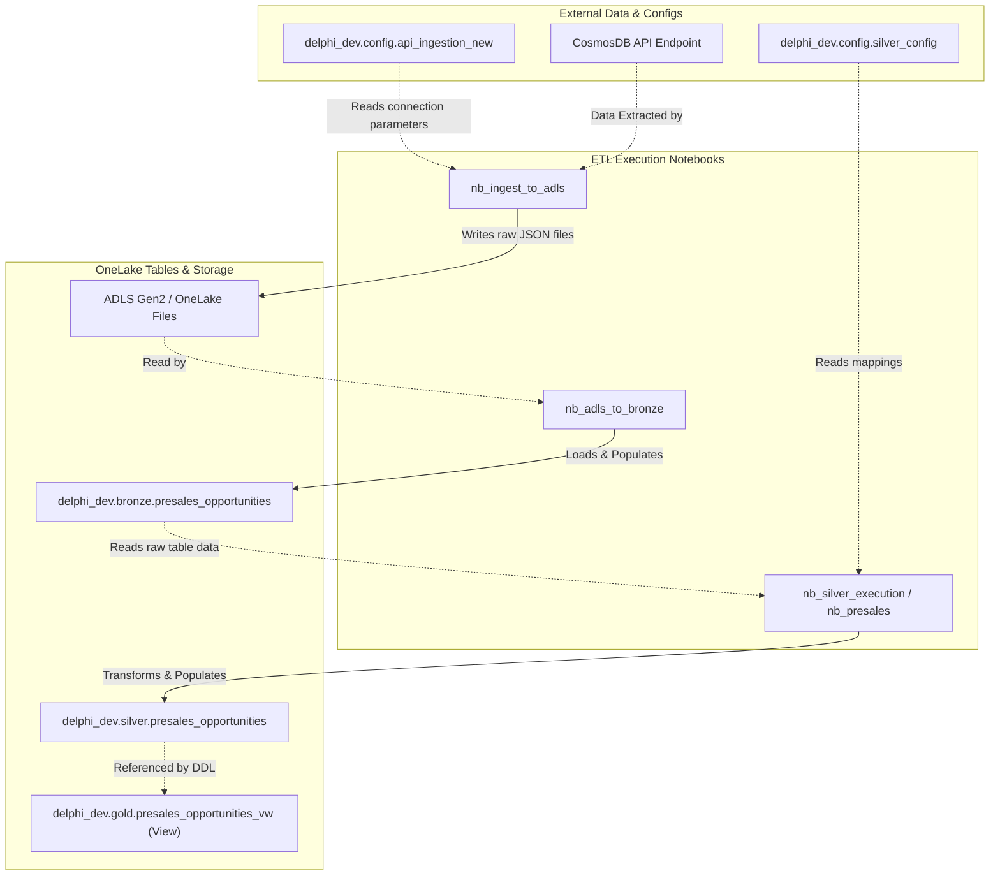

# PreSales Domain Assessment & Strategy Report

**Report Date:** 2026-07-08  
**Source Workspace:** Databricks (Unity Catalog)  
**Target Workspace:** Microsoft Fabric (`My_Test_V` / `New Sample Test`)  
**Domain Scope:** PreSales Data Engineering Pipelines  

This document merges the **PreSales Discovery Inventory** and the **Migration Assessment Strategy**, serving as the master blueprint for the PreSales workload migration project.

---

## PART I: DISCOVERY INVENTORY
## 1. Orchestrated Workflows (Jobs)

The following multi-task job orchestrates the PreSales ingestion and execution pipeline:

* **Job Name:** `pl_master_presales`
* **Job ID:** `927561703631282`
* **Creator/Owner:** `vbrahmapurkar@delphime.com` (verified owner)
* **Schedule:** Run daily at 1:00 AM IST (cron: `13 0 1 * * ?`) 

**Task Execution DAG Sequence:**
| Task Key | Task Type | Source Notebook Path |
| :--- | :--- | :--- |
| `nb_generate_run_id` | notebook | `/Workspace/Shared/Delphi EDP/utils/nb_generate_run_id` |
| `Ingest_to_ADLS` | notebook | `/Workspace/Shared/Delphi EDP/utils/nb_ingest_to_adls` |
| `Ingest_to_bronze` | notebook | `/Workspace/Shared/Delphi EDP/utils/nb_adls_to_bronze` |
| `nb_silver_execution` | notebook | `/Workspace/Shared/Delphi EDP/utils/nb_silver_execution` |

---

## 2. Notebooks Inventory

These 6 notebooks execute the core ETL transformations and utility helper steps for PreSales:

| Notebook Name | Workspace Path | Primary Language | Function / Role in Pipeline |
| :--- | :--- | :--- | :--- |
| `nb_presales` | `/Shared/Delphi EDP/silver/nb_presales` | `Language.PYTHON` | Dynamic child notebook triggered by silver runner. |
| `nb_ingest_to_adls` | `/Shared/Delphi EDP/utils/nb_ingest_to_adls` | `Language.PYTHON` | Fetches opportunities from CosmosDB API and writes to raw storage. |
| `nb_silver_execution` | `/Shared/Delphi EDP/utils/nb_silver_execution` | `Language.PYTHON` | Coordinates silver execution dynamically. |
| `nb_util_functions` | `/Shared/Delphi EDP/utils/nb_util_functions` | `Language.PYTHON` | Helper utilities (filesystem mappings, logging). |
| `nb_adls_to_bronze` | `/Shared/Delphi EDP/utils/nb_adls_to_bronze` | `Language.PYTHON` | Extracts JSON files from ADLS and loads to bronze table. |
| `nb_generate_run_id` | `/Shared/Delphi EDP/utils/nb_generate_run_id` | `Language.PYTHON` | Generates a unique execution run ID. |

---

## 3. Database Tables & Columns Metadata

Below are the details of the tables and views mapped to the `delphi_dev` Unity Catalog:

### Table: `delphi_dev.silver.presales_opportunities`

**Schema Layout:**
| Column Name | Source Catalog Data Type | Replicated to Fabric? |
| :--- | :---: | :---: |
| `Year` | string | **Yes** |
| `Month` | string | **Yes** |
| `Closure_Month` | string | **Yes** |
| `BU` | string | **Yes** |
| `Client` | string | **Yes** |
| `Deal_Name` | string | **Yes** |
| `Project_Type` | string | **Yes** |
| `Account_Manager` | string | **Yes** |
| `Presales_POC` | string | **Yes** |
| `Status` | string | **Yes** |
| `Probability_Percent` | string | **Yes** |
| `Probability_Label` | string | **Yes** |
| `USD_Amount` | string | **Yes** |
| `Weighted_Amount` | string | **Yes** |
| `Core_Technical_Support` | string | **Yes** |
| `Support_Techno_Functional` | string | **Yes** |
| `Created_At` | string | **Yes** |
| `Last_Updated` | string | **Yes** |
| `_ingested_at` | timestamp | **Yes** |
| `Days_Since_Update` | string | **Yes** |
| `Actions` | string | **Yes** |

### Table: `delphi_dev.bronze.presales_opportunities`
* **Table Description:** Bronze staging table storing raw opportunity files extracted from CosmosDB.

**Schema Layout:**
| Column Name | Source Catalog Data Type | Replicated to Fabric? |
| :--- | :---: | :---: |
| `Year` | string | **Yes** |
| `Month` | string | **Yes** |
| `BU` | string | **Yes** |
| `Client` | string | **Yes** |
| `Deal_Name` | string | **Yes** |
| `Project_Type` | string | **Yes** |
| `Account_Manager` | string | **Yes** |
| `Presales_POC` | string | **Yes** |
| `Status` | string | **Yes** |
| `Probability_Percent` | string | **Yes** |
| `Probability_Label` | string | **Yes** |
| `USD_Amount` | string | **Yes** |
| `Weighted_Amount` | string | **Yes** |
| `Core_Technical_Support` | string | **Yes** |
| `Support_Techno_Functional` | string | **Yes** |
| `Created_At` | string | **Yes** |
| `Last_Updated` | string | **Yes** |
| `_ingested_at` | timestamp | **Yes** |

### Table: `delphi_dev.gold.presales_opportunities_vw`
* **Table Description:** Gold analytics view presenting cleaned and column-formatted deal opportunities metrics.

**Schema Layout:**
| Column Name | Source Catalog Data Type | Replicated to Fabric? |
| :--- | :---: | :---: |
| `Year` | string | **Yes** |
| `Month` | string | **Yes** |
| `Closure_Month` | string | **Yes** |
| `BU` | string | **Yes** |
| `Client` | string | **Yes** |
| `Deal_Name` | string | **Yes** |
| `Project_Type` | string | **Yes** |
| `Account_Manager` | string | **Yes** |
| `Presales_POC` | string | **Yes** |
| `Status` | string | **Yes** |
| `Probability_Percent` | string | **Yes** |
| `Probability_Label` | string | **Yes** |
| `USD_Amount` | string | **Yes** |
| `Weighted_Amount` | string | **Yes** |
| `Core_Technical_Support` | string | **Yes** |
| `Support_Techno_Functional` | string | **Yes** |
| `Created_At` | string | **Yes** |
| `Last_Updated` | string | **Yes** |
| `_ingested_at` | timestamp | **Yes** |
| `Days_Since_Update` | string | **Yes** |
| `Actions` | string | **Yes** |

---

## 4. Security & Access Control

### A. Column-Level Masking Scan
A scan of the columns identified the following sensitive fields:
* **Table:** `delphi_dev.config.api_ingestion_new` | **Column:** `password` | **Type:** `string` $
ightarrow$ Recommend Dynamic Data Masking using T-SQL function `default()` on SQL Endpoint.
* Other tables do not contain PII or financial indicators requiring masking.

### B. SQL Endpoint Permissions
To replicate Databricks schema permissions, the following grants must be applied to user groups:
* `db_owner` $
ightarrow$ Allocated to `vbrahmapurkar@delphime.com`.
* `db_datareader` $
ightarrow$ Allocated to developer team group `ssingh@delphime.com`, `tarora@delphime.com`, `yahuja@delphime.com`.

---

## 5. PreSales Data Lineage Map

Below is the step-by-step dependency mapping showing how tables and notebooks interact during pipeline execution:



### Detailed Lineage Flow Description:
1. **CosmosDB Endpoint** $\rightarrow$ **`nb_ingest_to_adls`** $\rightarrow$ Writes raw JSON output files in the ADLS landing folders. Connection URLs and security tokens are loaded from **`config.api_ingestion_new`**.
2. **ADLS Gen2 Landing Folder** $\rightarrow$ **`nb_adls_to_bronze`** $\rightarrow$ Parses raw JSON datasets and writes them to the staging table **`delphi_dev.bronze.presales_opportunities`**.
3. **`delphi_dev.bronze.presales_opportunities`** $\rightarrow$ **`nb_silver_execution`** (running worker **`nb_presales`**) $\rightarrow$ Transforms staging columns and writes the cleaned datasets to the target table **`delphi_dev.silver.presales_opportunities`**. Transformation parameters are loaded from **`config.silver_config`**.
4. **`delphi_dev.silver.presales_opportunities`** $\rightarrow$ **`delphi_dev.gold.presales_opportunities_vw`** $\rightarrow$ Referenced by the Synapse SQL View definitions to build custom-formatted analytical models.
5. **Ingestion Logging:** **`log.ingestion_log`** is updated by the ingestion notebooks; **`log.silver_run_log`** is updated by the silver execution coordinator.

### Notebook-Table Reference Mapping Table:
| Notebook Name | Tables Read (Inputs) | Tables Written / Updated (Outputs) | Description / Action |
| :--- | :--- | :--- | :--- |
| `nb_generate_run_id` | *None* | *None* | Generates workflow execution ID in-memory. |
| `nb_ingest_to_adls` | `config.api_ingestion_new` | `log.ingestion_log` | Reads API credentials and logs landing raw file statuses. |
| `nb_adls_to_bronze` | *None* (Raw Files) | `bronze.presales_opportunities`, `log.ingestion_log` | Parses raw files, updates log and loads to staging table. |
| `nb_silver_execution` / `nb_presales` | `bronze.presales_opportunities`, `config.silver_config` | `silver.presales_opportunities`, `log.silver_run_log` | Reads staging data and configures to target clean table. |
| `nb_util_functions` | *None* | *None* | Common helper classes and file mapping functions. |

---

## PART II: MIGRATION ASSESSMENT & FEASIBILITY

### Prerequisites for Migration
Before executing the migration steps outlined in this blueprint, ensure the following prerequisites are met or verified:

1. **Target Workspace Provisioning:**
   * If a target workspace name or GUID is not specified, a new workspace named `presales_workspace` will be created automatically.
   * **Active Capacity:** The workspace must be assigned to an active Fabric capacity (such as the Delphi Trial Capacity `16e33d7d-eb1a-4088-89cf-2051b2226673`) to allow creating data pipelines and notebook items.
2. **Schema-Enabled Lakehouse Provisioning:**
   * If a target Lakehouse is not specified, a schema-enabled Lakehouse (`enableSchemas: true` creation payload) named `lakehouse_dev` will be provisioned. This is required to support nested folders (e.g. `Tables/silver/`) without causing "unidentified folders" explorer errors.
3. **Authentication Token Caching:**
   * Verify that AAD authentication tokens are cached locally at `C:\Users\VaradBrahmapurkar\.gemini\antigravity-ide\scratch\fabric_tokens.json`. The tokens must be active (expires every 3600 seconds) and include scopes for the Fabric REST API, OneLake storage API, and SQL Analytics Endpoint database connection.
4. **Databricks Warehouse Access:**
   * Ensure that the `.env` file contains valid credentials for the Databricks Workspace (`DATABRICKS_HOST` and `DATABRICKS_TOKEN`) and an active SQL Warehouse ID (`DATABRICKS_WAREHOUSE_ID`) to query source catalog tables.
5. **Local Library Dependencies:**
   * Ensure the local virtual Python environment (`.venv`) has the required packages installed, specifically `databricks-sdk`, `pandas`, `azure-storage-file-datalake`, and `deltalake`.

---
## 1. PreSales Asset Mapping Directory (Direct vs. Workaround)

Based on the Discovery Report, the following table lists the migration path for each PreSales asset:

| Discovered PreSales Asset | Target Fabric Object | Direct Migration? | Migration Strategy / Technical Workaround |
| :--- | :--- | :---: | :--- |
| **`config.api_ingestion_new`** | `config.api_ingestion_new` | **Yes** | Copy Delta transaction logs and Parquet files via ABFSS to OneLake schema subfolder. |
| **`config.silver_config`** | `config.silver_config` | **Yes** | Copy Delta transaction logs and Parquet files via ABFSS to OneLake schema subfolder. |
| **`log.ingestion_log`** | `log.ingestion_log` | **Yes** | Copy Delta transaction logs and Parquet files via ABFSS to OneLake schema subfolder. |
| **`log.silver_run_log`** | `log.silver_run_log` | **Yes** | Copy Delta transaction logs and Parquet files via ABFSS to OneLake schema subfolder. |
| **`bronze.presales_opportunities`**| `bronze.presales_opportunities`| **Yes** | Copy Delta transaction logs and Parquet files via ABFSS to OneLake schema subfolder. |
| **`silver.presales_opportunities`**| `silver.presales_opportunities`| **Yes** | Copy Delta transaction logs and Parquet files via ABFSS to OneLake schema subfolder. |
| **`gold.presales_opportunities_vw`**| `gold.presales_opportunities_vw`| **No** | **Workaround:** Extract view SQL, remove catalog prefix (`delphi_dev.`), convert Spark `DATE_FORMAT` to T-SQL `FORMAT`, and run on SQL Endpoint. |
| **6 Pipeline Notebooks** | 6 Fabric Notebooks | **Yes (with regex)** | **Workaround:** Export as IPYNB, run regex transformations (widgets $\rightarrow$ mssparkutils, taskValues $\rightarrow$ exit codes), and upload via REST API. |
| **Job `pl_master_presales`** | Fabric Data Pipeline | **No** | **Workaround:** Recreate sequential task DAG as a Data Pipeline containing 4 `TridentNotebook` activities with expression bindings. |
| **User Privileges** | Workspace Roles & SQL ACLs | **No** | **Workaround:** Map workspace developer roles (Contributor/Viewer) and execute T-SQL `GRANT` commands on the SQL Endpoint. |
| **Password Column** | Dynamic Data Masking | **No** | **Workaround:** Execute T-SQL `MASKED WITH (FUNCTION = 'default()')` directly on the SQL Analytics Endpoint column. |

---

## 2. Detailed Technical Execution Steps

### **A. Tables Ingest Process**
1. Run a query on the Databricks SQL Warehouse to retrieve all records from the target table.
2. Store records in a local Pandas DataFrame and convert null/empty values to standard string equivalents.
3. Write the DataFrame to a local folder in Delta format using the `write_deltalake` Python library.
4. Establish an ADLS Gen2 REST API connection using the Fabric storage token.
5. Upload the files recursively to the schema-enabled lakehouse directory:
   `abfss://<workspace_id>@onelake.dfs.fabric.microsoft.com/<lakehouse_id>/Tables/<schema_name>/<table_name>/`
6. Connect to the Synapse SQL Analytics Endpoint database and execute a polling loop query (sleeping 6 seconds between checks) to confirm the table syncs and is queryable in the system catalog views:
   ```sql
   SELECT COUNT(*) FROM sys.tables WHERE name = 'table_name' AND SCHEMA_NAME(schema_id) = 'schema_name'
   ```

### **B. Views Deployment Process**
1. Retrieve the original view SQL statement from Databricks using the `SHOW CREATE TABLE` statement.
2. Remove Unity Catalog prefixes (replace `delphi_dev.silver.presales_opportunities` with `silver.presales_opportunities`).
3. Convert Spark SQL date functions to T-SQL functions (replace `DATE_FORMAT(col, 'yyyy-MM')` with `FORMAT(CAST(col AS DATE), 'yyyy-MM')`).
4. Connect to the SQL Analytics Endpoint server using database AAD tokens.
5. Drop the old view if it already exists:
   ```sql
   IF EXISTS (SELECT * FROM sys.views WHERE name = 'presales_opportunities_vw' AND SCHEMA_NAME(schema_id) = 'gold')
       DROP VIEW gold.presales_opportunities_vw;
   ```
6. Run the translated query `CREATE VIEW gold.presales_opportunities_vw AS ...` on the SQL Analytics Endpoint.

### **C. Notebooks Translation Process**
1. Export the source notebook in Jupyter notebook format using the Databricks Workspace Client.
2. Parse the code cells in python and execute regex pattern matches:
   * Map widgets definitions (`dbutils.widgets.text`) to warning comments.
   * Map widgets lookups (`dbutils.widgets.get`) to parameters contexts (`mssparkutils.runtime.context.get`).
   * Map orchestration values set (`dbutils.jobs.taskValues.set`) to exit calls (`mssparkutils.notebook.exit`).
   * Map orchestration values get (`dbutils.jobs.taskValues.get`) to parameter expressions (`mssparkutils.runtime.context.get`).
3. Query the target workspace items via Fabric REST API. If the notebook exists, execute a delete REST call and wait 8 seconds for locks to release.
4. Encode the notebook payload to base64 and execute a POST request to the Fabric creation endpoint:
   `POST https://api.fabric.microsoft.com/v1/workspaces/{workspace_id}/notebooks`

### **D. Data Pipeline Setup Process**
1. Check the target workspace. If a pipeline named `pl_master_presales` exists, execute a delete REST call and wait 10 seconds for locks to release.
2. Execute a POST request to create an empty Data Pipeline item in the target workspace.
3. Parse the return GUID of the newly created pipeline.
4. Construct the pipeline content definition JSON:
   * Declare 4 activities of type `TridentNotebook` (sequential workflow).
   * Define `dependsOn` arrays between tasks to construct the sequential chain:
     `nb_generate_run_id` $\rightarrow$ `Ingest_to_ADLS` $\rightarrow$ `Ingest_to_bronze` $\rightarrow$ `nb_silver_execution`.
   * Configure exit value expressions to propagate parameter values dynamically:
     ```json
     "value": "@activity('nb_generate_run_id').output.firstExitValue"
     ```
5. Encode the pipeline json to base64 and upload the details to the Fabric pipeline `updateDefinition` endpoint to finalize the workflow schedule.

---

## 3. Post-Migration Verification & Validation Reports

Every completed PreSales migration generates three standardized reports containing specific verification metrics:

### **1. `validation_report.md` (and copy in `migration_plans/`)**
Contains validation parameters showing tables structure and row counts reconciliations:
* **Migration Summary:** Mapped source and target path locations, row counts, and status indicators.
* **Reconciliation Report:** Comparison table showing total rows, distinct key counts, and null key counts in both Databricks and the Fabric SQL Endpoint showing zero variance.
* **Side-by-Side Comparison:** Value comparison check for the first record ordered by deal name to ensure data integrity.
* **Table Schema & Translation Definitions:** Schema datatype maps and T-SQL view query translation statements.
* **Fabric Execution Logs:** SQL Endpoint query log outputs confirming the view is queryable.

### **2. `test_execution_report.md` (and copy in `Reports/Test Execution Report/`)**
Contains proof of execution for 10 functional and technical test cases:
* **TC-01 (OneLake storage path):** Verifies Delta logs are successfully written in the ADLS directory structure.
* **TC-02 (SQL Endpoint table registration):** Verifies the tables sync automatically.
* **TC-03 (SQL Endpoint view creation):** Verifies the view metadata is registered in the database catalog.
* **TC-04 (Column schema match):** Verifies columns layout matches target specifications.
* **TC-05 (Data types):** Verifies data type conversions (integers, strings) match source tables.
* **TC-06 (Row count reconciliation):** Verifies counts match exactly.
* **TC-07 (Key uniqueness):** Verifies primary keys have zero duplicates.
* **TC-08 (Key nullable check):** Verifies primary keys contain zero null values.
* **TC-09 (Sample data comparison):** Verifies value matching on sample records.
* **TC-10 (SQL Endpoint compilation):** Verifies executing queries on the SQL Endpoint executes without syntax errors.

### **3. `notebook_conversion_report.md` (and copies in `Reports/Notebook Conversion Report/` and `migration_plans/`)**
Contains notebook code analysis and code verification metrics:
* **Migration Summary:** Source/target paths, languages, and import success state.
* **Translation details:** Detailed table showing original Databricks widgets/tasks syntax side-by-side with converted Fabric Spark equivalents.
* **Dependency check:** Verifies all referenced utility helper notebooks exist in the workspace.
* **Manual post-migration tasks:** Details parameter bindings and schedule triggers to execute inside the Fabric Data Pipeline.


---

## PART III: TABLE METADATA REPLICATION & RECREATION BLUEPRINT

This section details the general metadata behavior when migrating Databricks Delta tables to Microsoft Fabric OneLake, highlighting what replicates automatically and what requires manual reconstruction.

### 1. General Metadata Capability Mapping

| Metadata Category | Replicated Automatically? | Description / Mapping Behavior |
| :--- | :---: | :--- |
| **Table Schema Layout** | **Yes** | Column names and matching target data types (strings, integers, timestamps) are preserved. |
| **Physical Partitioning** | **Yes** | Storage folders partitioning structure (e.g. `status=`) remains intact in OneLake. |
| **Transaction History** | **Yes** | The Delta transaction logs (`_delta_log/`) map directly, maintaining commit metrics. |
| **Table-Level Comment** | **Yes (Spark only)** | Table descriptions map to OneLake logs and display during Spark session queries. |
| **Column-Level Comments** | **No** | Column descriptions stored in Unity Catalog metastore do not map to SQL Endpoint catalogs. |
| **Key Constraints (PK/FK)** | **No** | Database keys are lost and must be recreated as non-enforced constraints in Fabric. |
| **Optimization Properties** | **No** | Settings like `delta.autoOptimize` are ignored; Fabric manages compactions natively. |

### 2. Manual Re-creation Blueprints (T-SQL Recipes)
To reconstruct the lost metastore metadata properties on your migrated tables, run these general commands against the Fabric **SQL Analytics Endpoint**:

#### A. Re-creating Database Key Constraints
Fabric SQL Analytics Endpoints support primary and foreign keys, but they **must be declared as non-enforced (informational)** constraints using `NONCLUSTERED` and `NOT ENFORCED` syntax:
```sql
ALTER TABLE <schema_name>.<table_name> 
ADD CONSTRAINT <constraint_name> PRIMARY KEY (column_name) NONCLUSTERED NOT ENFORCED;
```

#### B. Re-creating Table & Column Comments
Assign table and column descriptions as database Extended Properties on the SQL Endpoint:
```sql
-- Re-create table description
EXEC sp_addextendedproperty 
    @name = N'MS_Description', @value = N'Your Table Description Here', 
    @level0type = N'SCHEMA',   @level0name = 'schema_name', 
    @level1type = N'TABLE',    @level1name = 'table_name';

-- Re-create column description
EXEC sp_addextendedproperty 
    @name = N'MS_Description', @value = N'Your Column Description Here', 
    @level0type = N'SCHEMA',   @level0name = 'schema_name', 
    @level1type = N'TABLE',    @level1name = 'table_name', 
    @level2type = N'COLUMN',   @level2name = 'column_name';
```